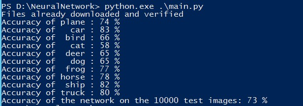
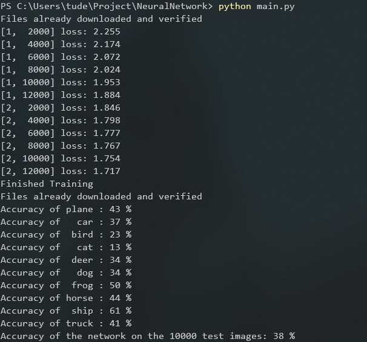
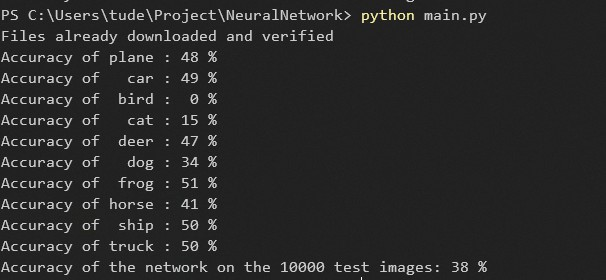
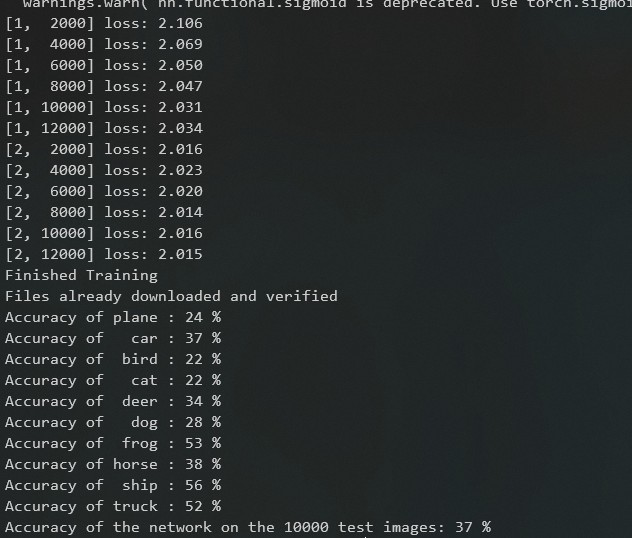

# NeuralNetwork

Homework of course intruduction to AI

## 环境配置说明

* `Python 3.7.3`

* `pytorch-cpu 1.3.1`

## CNN神经网络

CNN神经网络即卷积神经网络

### CNN的特点

使用了一个卷积核，将高维的图像数据转化为更低维度的数据，从而实现降维和模式识别。

### 参数设置

```py
self.conv1 = nn.Conv2d(3, 300, 5)
self.pool = nn.MaxPool2d(2, 2)
self.conv2 = nn.Conv2d(300, 160, 5)
self.fc1 = nn.Linear(160 * 5 * 5, 120)
self.fc2 = nn.Linear(120, 84)
self.fc3 = nn.Linear(84, 10)
```

### 结果



## RNN神经网络

RNN神经网络即循环神经网络，我使用了Pytorch的LSTM包来实现

### 参数设置

```py
self.rnn = nn.LSTM(
    input_size=32*3,
    hidden_size=64,
    num_layers=1,
    batch_first=True,
)
self.out = nn.Linear(64, 10)
```

### 结果



## 普通全连接神经网络

### 参数设置

```py
self.layer1 = nn.Linear(SIZE, 100)
self.layer2 = nn.Linear(100, 30)
self.layer3 = nn.Linear(30, 10)
```

### 结果



## LR分类器

逻辑斯蒂分类器

### 结果


